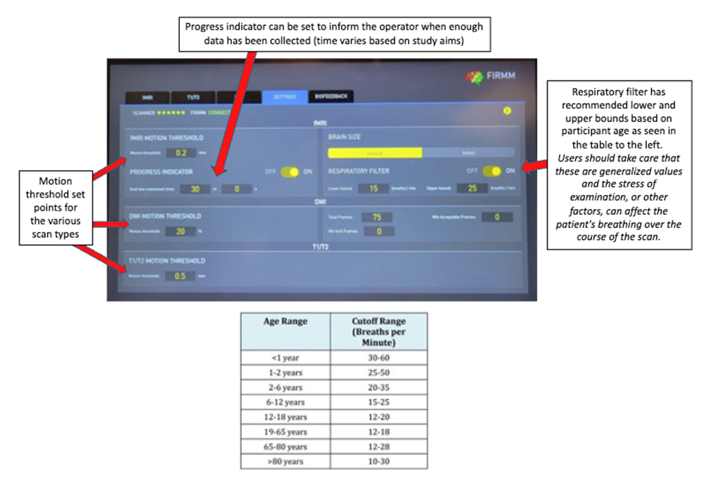
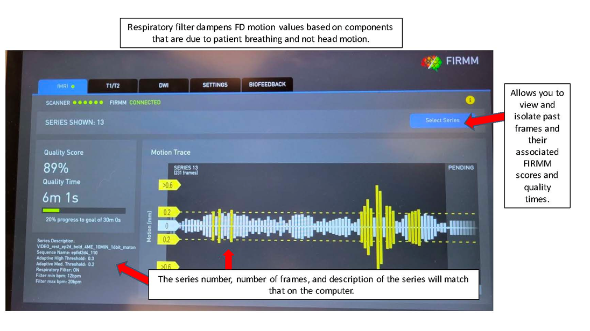

# FIRMM Tablet
The Framewise Integrated Real-time MRI Monitoring (FIRMM) tablet provides the console operator with information regarding the participant’s head motion while in the scanner. FIRMM provides this data for functional, structural, and diffusion scans.
<figure markdown="span" align='center'>
    
</figure>

## FIRMM Data
When recording FIRMM data, write down the quality score and quality time in minutes. For example, the above image’s quality score is 89% and quality time is 6.017 minutes. For fMRI (bold runs), you can gather quality scores and time with and without the respiratory filter on. To do so, navigate to settings and toggle the respiratory filter on and off. The respiratory filter does not influence T1/T2 structural or DWI scans.
<figure markdown="span" align='center'>
    
</figure>