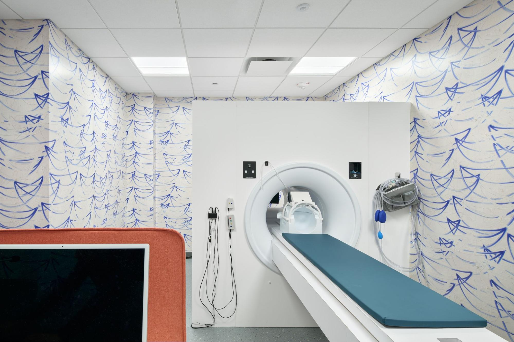

# Mock Scanner Suite
This is our practice scanner. The practice scanner room is located next to the suite lobby. The practice scanner is used to practice the steps of MRI scanning and allow participants to see, touch, feel, and hear different parts of an MRI scanner equipment.

<figure markdown="span" align='center'>
    
</figure>