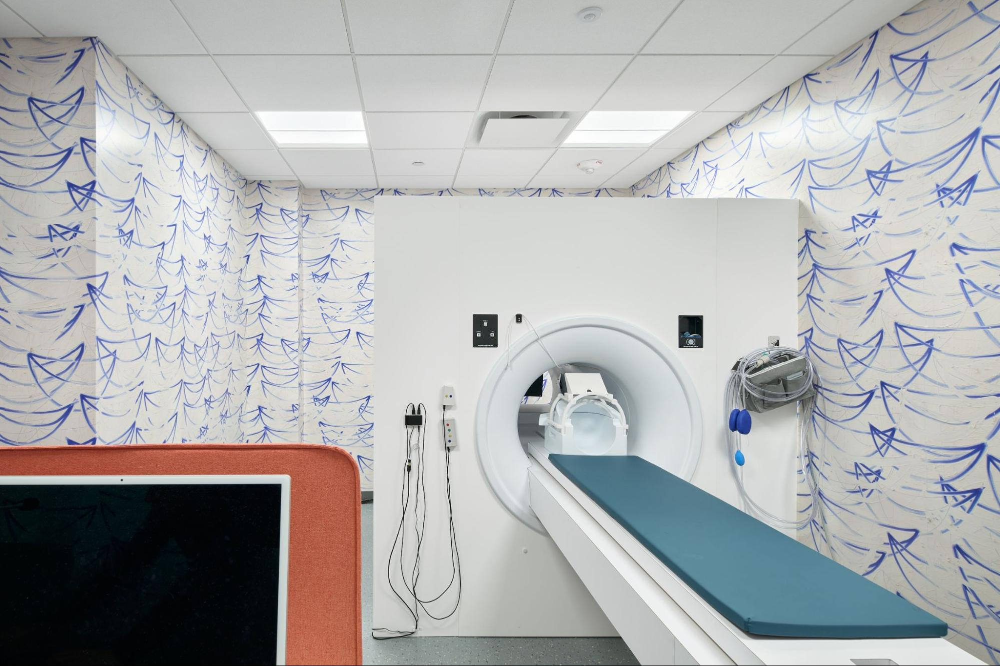

# Mock Scanner Suite
This is our practice scanner. The practice scanner room is located next to the suite lobby. The practice scanner is used to practice the steps of MRI scanning and allow participants to see, touch, feel, and hear different parts of an MRI scanner equipment.

<figure markdown="span" align='center'>
    
</figure>

## Mock Scanner MRI Sounds
Here you can preview and download MRI sounds. These sounds can be played for participants so they will know what to expect when they get into the scanner.
!!! warning
    Previews can be loud!

- [Siemens_Localizer](../downloads/Siemens_Localizer.wav)
- [ Siemens_PD-T2](../downloads/Siemens_PD-T2.wav)
- [Siemens_DTI.wav](../downloads/Siemens_DTI.wav)
- [CryogenicPump.wav](../downloads/CryogenicPump.wav)

<!-- - <a href="/neuroimaging-rtd.readthedocs.io/en/latest/downloads/Siemens_Localizer.wav" download="Siemens_Localizer.wav">Siemens_Localizer</a>
- <a href="/downloads/Siemens_PD-T2.wav" download="Siemens_PD-T2.wav">Siemens_PD-T2</a>
- <a href="/downloads/Siemens_DTI.wav" download="Siemens_DTI.wav">Siemens_DTI</a>
- <a href="/downloads/CryogenicPump.wav" download="CryogenicPump.wav">CryogenicPump</a> -->