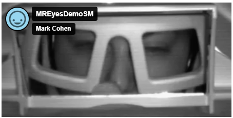
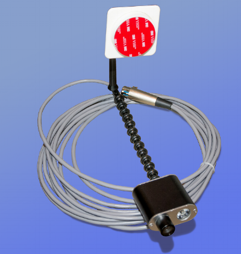
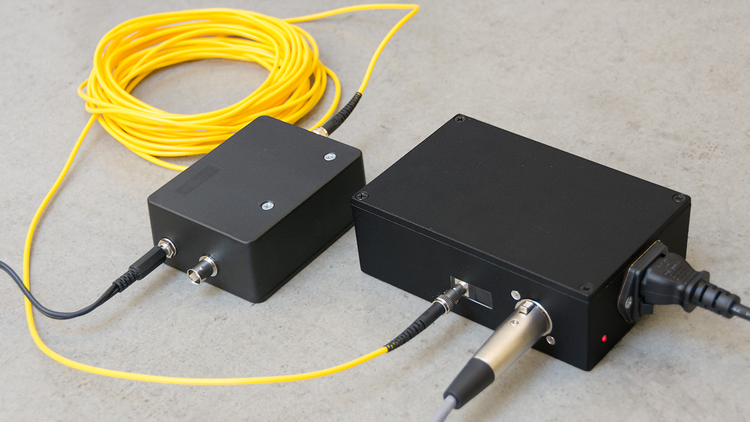

# MReyes Camera
Provides a clear view of the participant’s eyes to monitor alertness and changes in gaze. 
<figure markdown="span" align='center'>
    
</figure>

**Camera Set Up**

- The camera is mounted to the back of the bore, easily adjusted to the center to align with the eyes in the head coil.
<figure markdown="span" align='center'>
    
</figure>
- The black power box, labeled BORE CAMERA is located in the scanner side of the window to the control room. Flip the switch, there is a red indicator light when the camera is on.
<figure markdown="span" align='center'>
    
</figure>

**Control Room System Set Up**
- Open photobooth on the Mac
