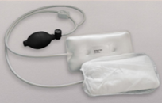
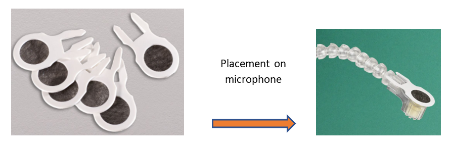
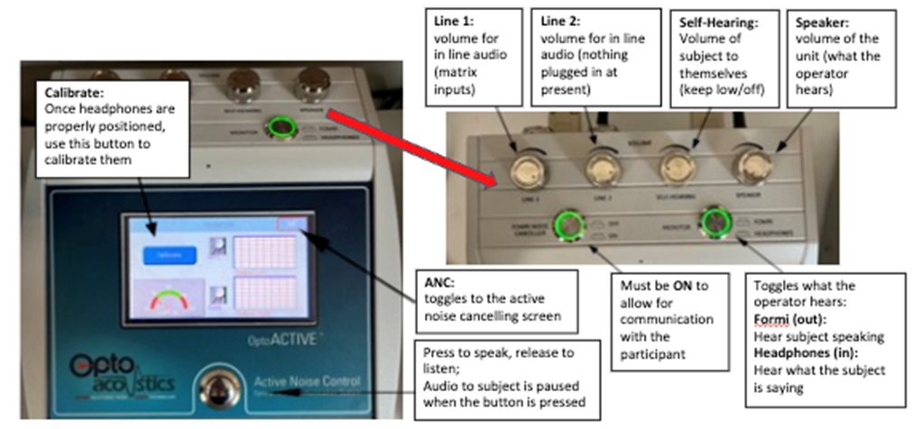

# OptoAcoustics Headset
This system allows for the delivery of audio stimulus to the participant as well as two-way communication with the operator. It offers ~15dB of passive noise protection in addition to the active noise cancellation available with some pulse sequences. The headset is located on the right side of the scanner. 

**Participant Set Up**

- Place the headphones so that the cushion portion fully surrounds each ear
    - Headphones are labeled L and R
- If there is space between the headphones and the head coil, insert the inflatable pads (pictured below) on each side and inflate until the headphones are snug against the participant’s head
<figure markdown="span" align='center'>
    
</figure>
- After the top of the head coil has been positioned, attach the microphone to the Velcro scrip on the participant’s left hand side
    - There are hygienic microphone covers that should be used – they are stored in the drawer labeled ‘Optoacoustics’.
<figure markdown="span" align='center'>
    
</figure>

**Calibrating the Headphones**
!!! note 
    Calibration checks the quality of the seal/fit between the headset and the subject’s head

- Once the subject is in the ready-to-scan position (note: table can be in or out of the bore), touch the ‘calibrate’ button to begin calibration
    - No audio stimulus should be delivered, and participant should not speak during this process
    - Participant will hear static noise in each ear as part of this process
- If both left and right have a green badge with white checkmark, calibration was successful
    - If one or both have a red circle with an X, double check headphone positioning and repeat calibration until successful

**Active Noise Cancelling (ANC)**
!!! tip
    ANC works well for EPI and DTI type sequences with relatively stable noise

- Toggle to the ANC screen and touch the ‘learn’ button
    - Once the scanner triggers, the system enters a 16s learning period and then ANC will automatically begin.
- The system needs to re-learn each new sequence, but this can be skipped if repeating the same sequence consecutively.

**Control Room System Set Up**
<figure markdown="span" align='center'>
    
</figure>

**Troubleshooting, Tips, and Recommendations**

- If the participant can’t hear you: hold down the button for 3 seconds, and then speak. Make sure the decibel meter is reaching the green region.
- For young kids, keep the speaker volume audible in the control room during scans in case they need assistance
