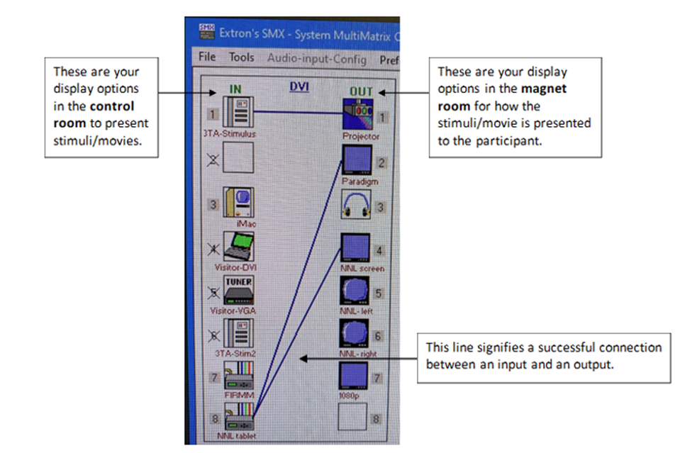

# At The Console

!!! tip
    Best practice is to “Restart System” before beginning your session. 

Protocol trees should follow the convention:

- Region: PI Last Name
- Exam: Project Identifier (e.g., MXXX)
- Protocol: (e.g., Pilot, Final)

Registering Participants:

- Never include PHI/PII (e.g., participant’s name or their day/month of birth)
- Birthdate should be entered as 1/1/[birth year]
- Enter accurate height and weight

## Handling Data
!!! tip
    MIDB studies should push/export data to Naxos. 

!!! warning
    - Data should not be considered protected at the console. 
    - Space is limited and data should be considered at high risk for being overwritten.  

Always export your data when your session is over AND check that it arrived. Double check that all scans made it in case of partial transfer. For more information see [Navigating to Naxos.](../cmrr/naxos.md){:target="_blank"}

### Export Data to CD/DVD
A portable DVD burner is in the control room (it's on the shelf above the mac) that can be plugged into the console tower. Extra CDs are also in the control room.

## Matrix Switch
The matrix switch centralizes all the peripheral visual/audio scanning equipment which allows users to use any combination of the available inputs/outputs.
1. The matrix switch is controlled by SMX application on the 3TD Control Computer
    - Launch the application and select ‘Comm 3’
    - There is no password, just hit enter 
2. Drag and drop icons from the input (IN) column to the output (OUT) column to connect them. A line will appear between the two icons if the connection was successful.
<figure markdown="span" align='center'>
    
</figure>

## Incidental Findings
If you happen to run into any incidental findings during a scan, please follow these steps:

1. Export the structural data (T1, T2) to FV_PACS.
2. Please be aware that if your scan was acquired using only one orientation (typically in the sagittal plane), you will need to reformat at least one of your 3D acquisitions in the other two directions before you send the data to PACS.
3. Submit a radiologist scan [review request](https://www.cmrr.umn.edu/scanreview/).
4. When submitting your request please note the following:
    - Location/Event ID (this is the CMRR Calendar Event #)
    - Anonymized Patient Name (This MUST match what was typed into the patient name field on the MRI scanner or it will stop the process)
    - Pertinent Clinical History
    - Description of MRI Series Sent
    - Select a Body Part from the drop down
    - Questions for reviewer (if any)
!!! note
    IMPORTANT: The “Patient ID” field cannot have any underscores. If it does, it will crash the Fairview servers.
    - If you typically use underscores in the Patient ID field:
        - Open the patient browser
        - Right click on your subject and select ‘correct’
        - Select the patient tab and edit the patient ID to remove the underscore
        - Hit ‘OK’
5. Send email to CMMR technologist Matt White (whit3045@umn.edu) letting them know a request has been entered.
6. If the Radiologist indicates that clinical follow-up is warranted you must contact the subject to relay that information and you must log back into the radiologist scan review system to confirm that the subject has been contacted.