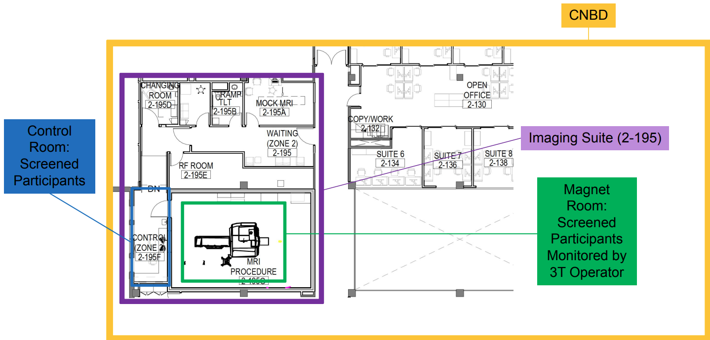
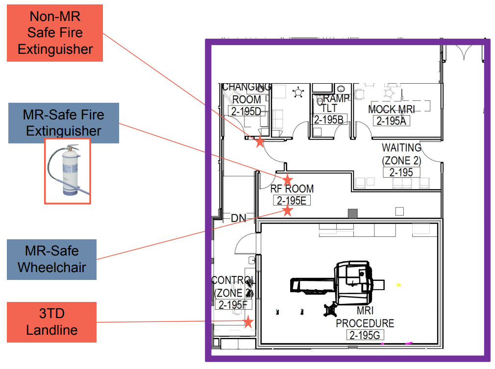
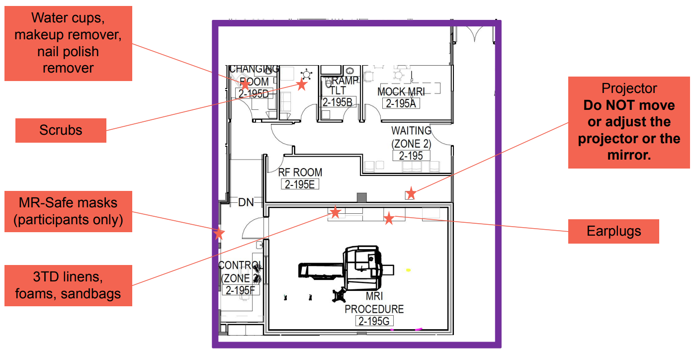
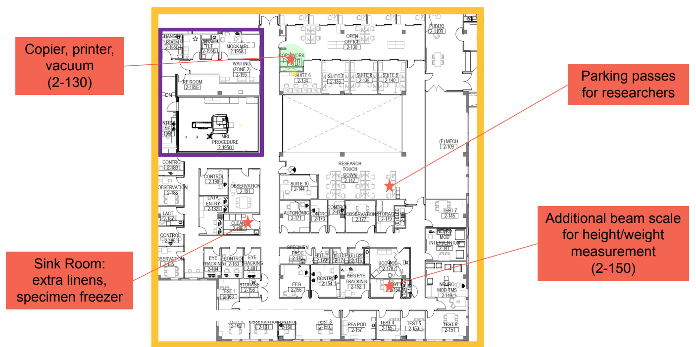
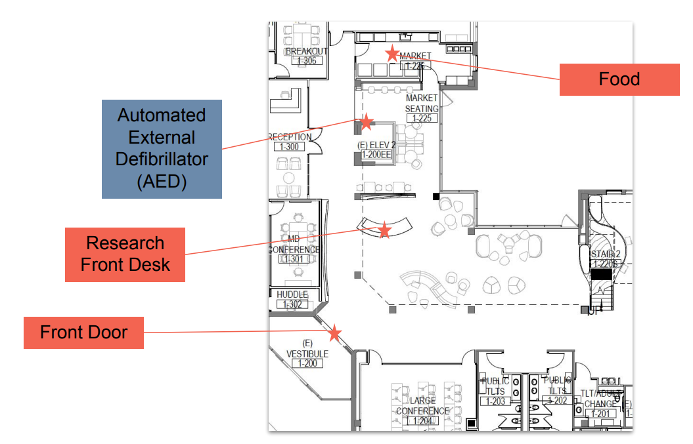
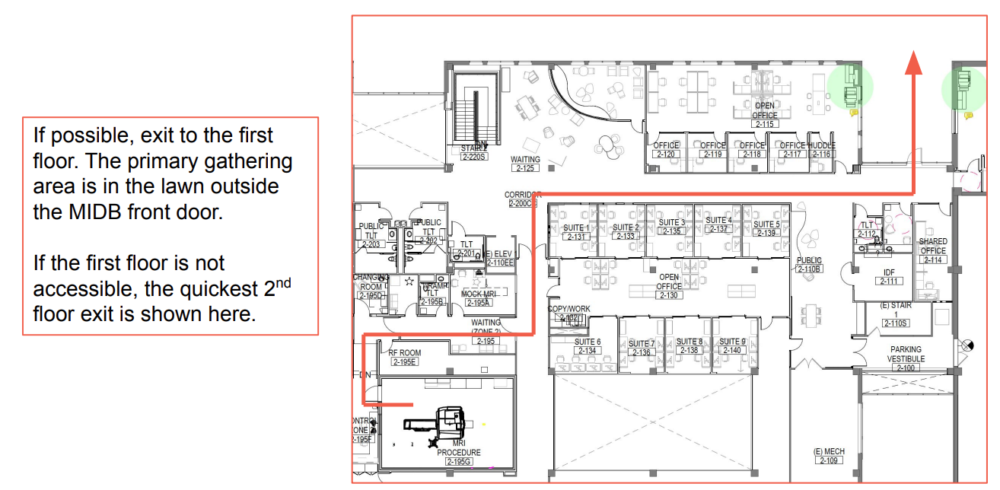

# Floor Plans for MIDB

## 3T-D Imaging Suite Layout
<figure markdown="span" align='center'>
    
</figure>

## Where To Find Things
### MRI Items
<figure markdown="span" align='center'>
    
</figure>   
<figure markdown="span" align='center'>
    
</figure>

### CNBD Items
<figure markdown="span" align='center'>
    
</figure>

### MIDB 1st Floor
<figure markdown="span" align='center'>
    
</figure>

### MIDB 2nd Floor
<figure markdown="span" align='center'>
    
</figure>