# Troubleshooting The Scanner
!!! note 
    Make sure coils are unplugged before restarting scanner

## If someone comes out of the scanner
- Need to rerun localizers & field maps 
- Field maps are required for resting runs, but not for structurals
- Go to dot cockpit and Ctrl + select + drag into protocol
- Remember to grab setter for structurals 

## Shutting down to the wall
!!! warning
    Please try to restart the computer prior to shutting down to the wall to see if the problem resolves.

## Audio Not Working (NNL disconnected / forgets it has speakers)
1. Go to device manager
2. Scan for hardware
3. Reconnect to speakers

# Common 3T Issues and Errors
## How to Reboot the System
- Go to System > End Session > Shutdown System
- Wait for the console computer to shut down completely.
- The message “It’s now safe to turn off your computer” will appear on the monitor, at which time you can shut off the console computer using the power button on the tower.
- Once the console computer shuts down, shutdown the scanner by pushing the “System off”’ button on the quench box.
    <figure markdown="span" align='center'>
        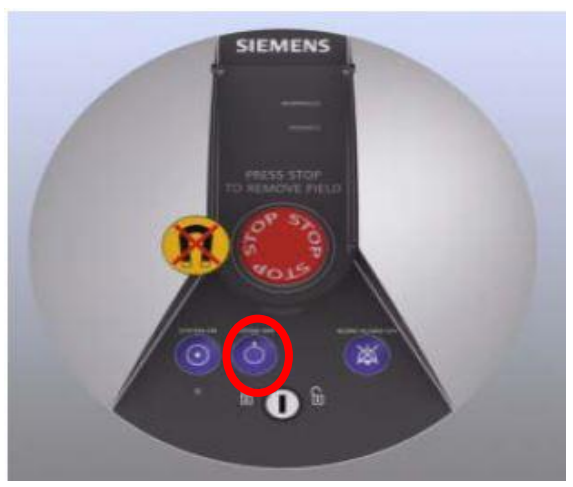
    </figure>
- Wait ~5 minutes, and then turn everything back on by pushing the “System on” button on the quench box.
    <figure markdown="span" align='center'>
        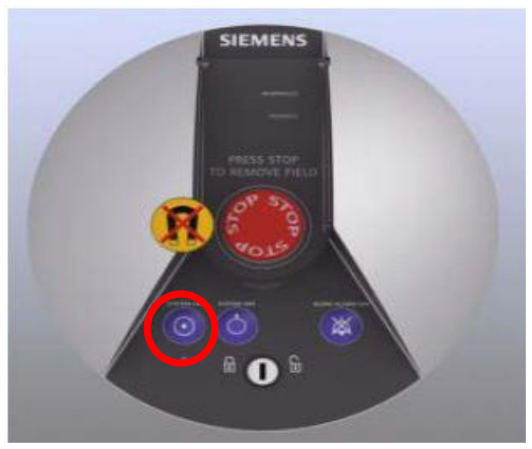
    </figure>

## Stimulation Monitor Warnings
**This warning message** (Figure 2) always appears upon initiating T2. Just click OK.
<figure markdown="span" align='center'>
    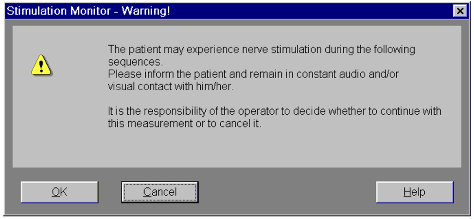
    <figcaption style='margin-top: 10px;'>Figure 2. Stimulation Warning at T2</figcaption>
</figure>

**This warning message** (Figure 3) appears upon initiating rfMRI or DWI when the FOV (yellow box) angle in the axial plane (the far right one) is too steep due to uncentered and tilted head position in the coil.
- Click “Open Protocol” or just close the warning window. (Do not click something else in the window.)
- Decrease the angle to something more shallow, then attempt to run the sequence again.
- Make sure to copy the adjusted slice positioning to the remaining PA-AP pair. (AP-PA pair must have the same slice positioning.)
- Make note of this warning message on the scan log.
<figure markdown="span" align='center'>
    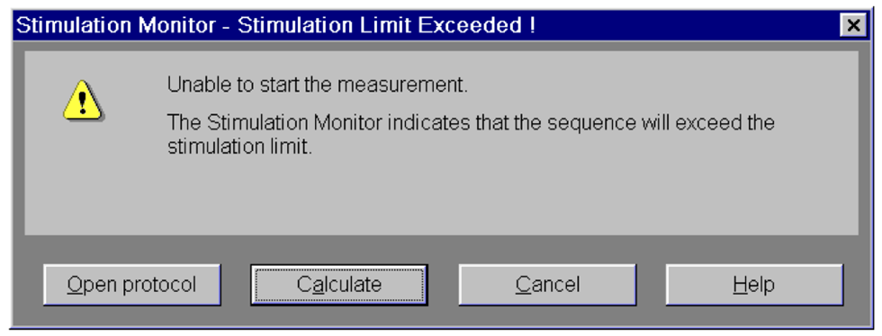
    <figcaption style='margin-top: 10px;'>Figure 3. Stimulation Limit Exceeds Warning</figcaption>
</figure>

## Preparation of measurement system failed error
This occurs when initiating rfMRI or DWI. The scanner doesn’t run the sequence and you will see  on the status bar on the console computer.

- For each sequence you have the error, go to Sequence > Special > uncheck “Save reduced raw data” and rerun the sequence.
- If the first thing doesn’t help, try rebooting system by going System > End Session > Shutdown System
- If you don’t want to full system shutdown, go System > Control > Meas&Recon tab > Reboot

## SMX Control Program Error
When you see error message like below (Figure 4)

- Quit the SMX control program and reopen.
- Choose “IP” option. When prompted for a password, just click Connect without entering a password.
<figure markdown="span" align='center'>
    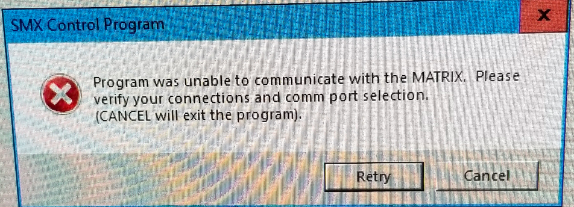
    <figcaption style='margin-top: 10px;'>Figure 4. SMX Control Program Error</figcaption>
</figure>

## Emergency table stop button pressed
<figure markdown="span" align='center'>
    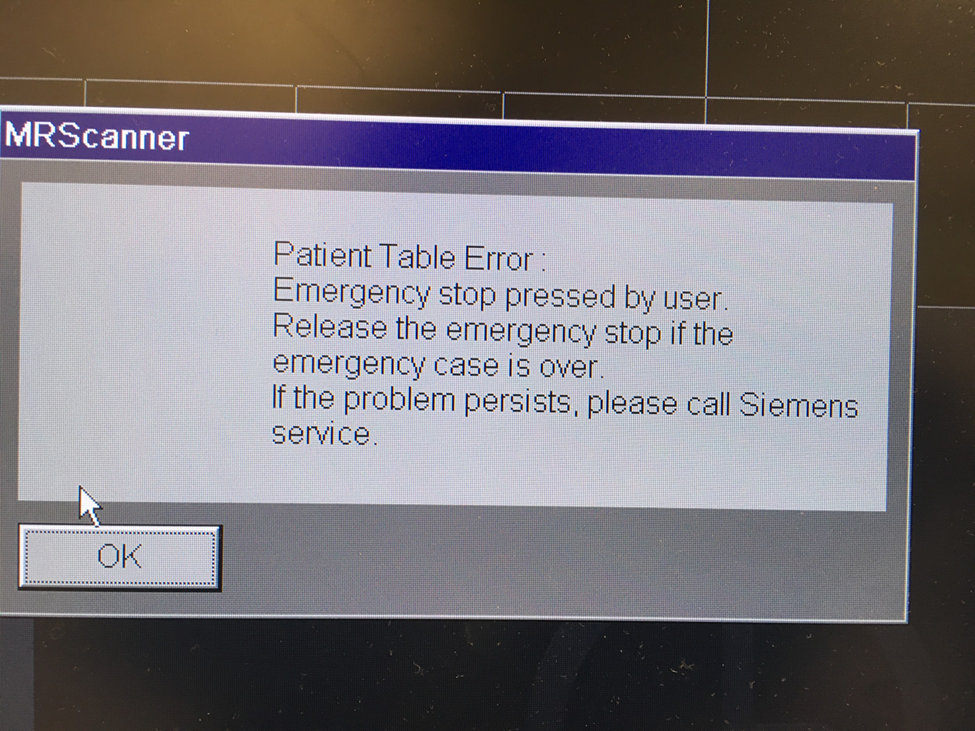
</figure>

- Reset the table stop by turning red control button clockwise
- Press up and down buttons simultaneously

## The Squeeze Ball/ Button Alarm sounds
- Stop the scanner using the mouse and clicking the stop icon in the lower left on the console screen
- To clear the alarm, press the talk button on the intercom associated with the squeeze ball, either #2 talk or #3 alarm
- Talk to your participant through the intercom system 
- **DO NOT** press the “Stop” button (#1) on the Siemens Talk Box, or you will need to reset the table.
<figure markdown="span" align='center'>
    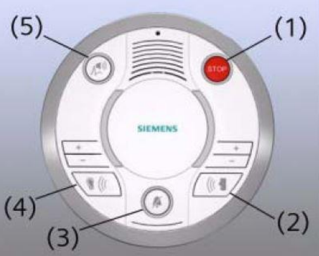
</figure>

## Emergency Patient Bed Release
In the event of an emergency or power outage, it is possible to remove the patient bed from the bore manually.
- First, locate the manual table release lever, near the foot of the bed on the right side.
    <figure markdown="span" align='center'>
        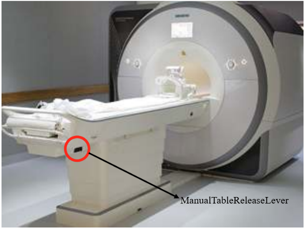
    </figure>
- Next, grab the handle near the foot of the bed and pull the bed out of the bore.
    <figure markdown="span" align='center'>
        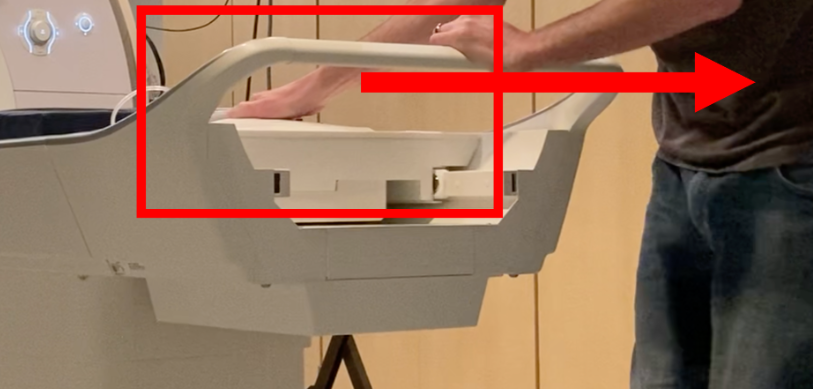
    </figure>
- Bed controls will start flashing, and the scanner display will provide instructions (below) to reset the bed position.

### To reset the table
- Press the button (7) on the side of the intercom box
    <figure markdown="span" align='center'>
        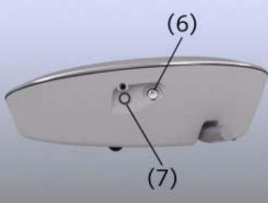
    </figure>
- Then, on the scanner, simultaneously press the Table Up and Table Down buttons.
    <figure markdown="span" align='center'>
        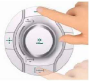
    </figure>

## Resolve naming errors (or change patient information) after scan is done
- Close patient 
- Open Patient Browser -> Select the folder you want to make changes -> Edit -> Correct

## The subject had to come out of the magnet; what do I need to do to continue the protocol?
- After positioning the subject, you will need to re-run the localizer. 
- All AP/PA paired scans must be the same, so if one is complete and then the sequence is interrupted, you must re-acquire both.

## The 3T just failed out, or refuses to go for unknown reasons.
- Try to just run the exact same thing again, or go on and re-run the failed scan later. If it won’t let you, contact the slack channel (or Jess & Kim).
- Go to System > Control -- the System Manager will pop up. 
    -  The arrows should be green from “postprocessing” on up; if one is red, click on it to see what’s going on
    - Click on “Meas & Recon” tab if anything is red; may need to select whatever is red and choose “Reboot”
    - “Periphery” tab should be all green
- Reboot the system if necessary

## The scanner (NOT the console) rebooted randomly
- Make a note on the error log and contact the slack channel (or Jess & Kim).
- Don't adjust the subject, but do check to see if patient is still registered on the scanner (this will appear on the scanner screen, and will say something like "New patient registered"), and do check to be sure they are still at isocenter 
- Once the scanner has finished rebooting, insert a localizer above the sequences remaining to be collected and run it
- Reapply the T1 shim to all sequences that remain to be collected
- Double check slice positioning of all remaining sequences (shouldn't change, but check just to be sure)

## The scanner is running, but no data is showing in the patient browser, although the patient is listed.
- There is an error in the recon computer. Run “Save Log” as described on the sheet below the console monitor.
- Note error on the sheet below the monitor.
- Reboot as described on the sheet below the monitor.

## The patient is not showing up in the Patient Browser.
- First try sorting by Date using the Sort menu at the top of the Patient Browser window to check the T1
- Continue to acquire the T2 but stop after that and reboot the console computer by going to System > Controls> Reboot. 
- When asked if you still want to shutdown choose Yes. 
- Once the computer is back on check the quality of the T1 and T2 
- If they look good and your participant is still in place and good to continue, start with a new localizer and the rest of the sequences.

## The console software is frozen 
- Ctl + Esc to access the Start menu and restart the computer -- this process takes ~10 minutes; the numbers displayed on the screen will progress from 0-100

## Helium level warning
- You may see the warning message (Figure 5), saying that the helium level of the magnet is below the warning threshold. This is a service warning. It is safe to use the magnet.
- You can click OK and proceed to scan.
- After clicking OK, you will continue to hear a beeping warning message coming from the Quench box. Don’t be alarmed by it. To turn off the alarm, you can hit the silent alarm button on the cleanse box to the right of the on and off button.
- Reach out to slack channel, email to Jess or Kim. 
<figure markdown="span" align='center'>
    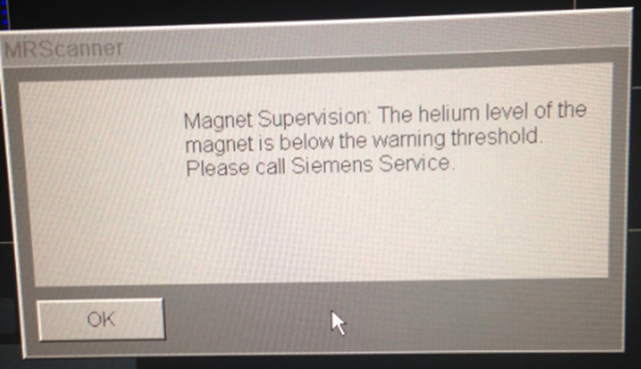
    <figcaption style='margin-top: 10px;'>Figure 5. Helium level warning message</figcaption>
</figure>

# Call Tree
1. 3TD-help Slack Channel
2. Jess Emerick  
3. Kim Weldon 
4. Steve Nelson 
!!! note
    Not a member of the Slack channel? Ask Jess to be added!

Safety Concerns, contact the Safety Officer - Jeramy Kulesa (ande2445@umn.edu)
Tech / peripherals - Jeromy Thotland (cmrrviz@umn.edu)
