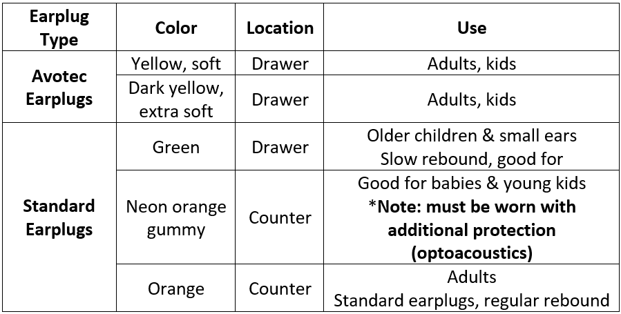

# Courteous Usage of the MRI Suite

## Setup
Basic protocol for scanning adults or children, adjust for younger participants.

1. In the far-left cabinet, pull out one sheet, one pillowcase, and the gray headrest.
2. Lay out the sheet on the table - make sure to avoid wrinkles to prevent any potential sensitivity challenges
3. Place the gray headrest inside the head coil and lay the pillowcase on top. It can often be easiest to fold the pillowcase into a square so it acts as an extra cushion.
4. Depending on participant size, place one of the three leg rests on the table.
5. Navigate to the earplug area and navigate to the proper earplugs.
    <figure markdown="span" align='center'>
        
    </figure>
6. In the drawer to the right, grab out a cover for the optoacoustic microphone if relevant
7. In the far-right drawer, grab out the physiological (physio) equipment - respiratory belt and balloon. You will also need to grab the two battery packs mounted to their charger on the wall directly outside the scanner in the control room. One is pulse ox (with the finger piece) and the other will be connected to the balloon that goes under the respiratory belt.
8. In this corner, you’ll want to press the NNL screen “on” button (if relevant, circle around power button will turn green) and move the screen in the back right corner to line up with the blue tape on the ground at the back of the scanner
9. If you are using the projector, go to the RF coil room and press “On/Stand by.” A green light should appear indicating that the projector is on. Ensure the NNL screen is not blocking the mirror.
10. You will want to switch the small black camera box “on” in the window between the control room and scanner to monitor eyes. Flip to “1”. Note that a red light will appear when on.

## Takedown
1. Linens go in the biohazard linens bag. Make sure to check for the gray pad, it should NOT go in the laundry!
2. Use a Clorox wipe and clean off anything sealed the participant touched (gray pad, squeeze ball, headphones, bed, etc.)
3. Return gray pad and any other support items
4. Return leg rest to cabinet
    - Black leg rests return to cabinet, gray leg rest can lean against the cabinet next to the biohazard linens bag
5. Discard earplugs (for avotec, make sure white connector attached to avotec tubes is not discarded) and microphone cover (optoacoustics)
6. Turn off NNL screen, eye camera, and/or projector
7. Return NNL screen to back right corner of the room
8. Return table to home position

!!! note
    Never place anything in the bore when the table is at home position

## Masking and Sanitization Policy
MR-safe masks for adults/children are provided by MIDB if requested.

!!! note
    Following scans with human subjects, wipe down non-porous, non-glass surfaces with sanitizing wipes (table bed, sealed foams, head coil, button box, etc.).

## Housekeeping
The Control Room can become cluttered very easily. Participants should utilize lockers in the change rooms for their belongings. Researchers should minimize personal belongings in the control room as much as possible. 

Please leave the Magnet Room neat and tidy for the next user. Put away all foams, head coils, and peripheral equipment. White linens should be deposited in the marked bins. 

Garbage and recycling will not be collected from the Control Room. If you are the last scan of the day, please move the bins to the Waiting Area outside the Control Room.

!!! note
    Report any broken or missing equipment to Kim Weldon (kweldon@umn.edu) or Jess Emerick (emeri036@umn.edu) so that it can be replaced or repaired ASAP.