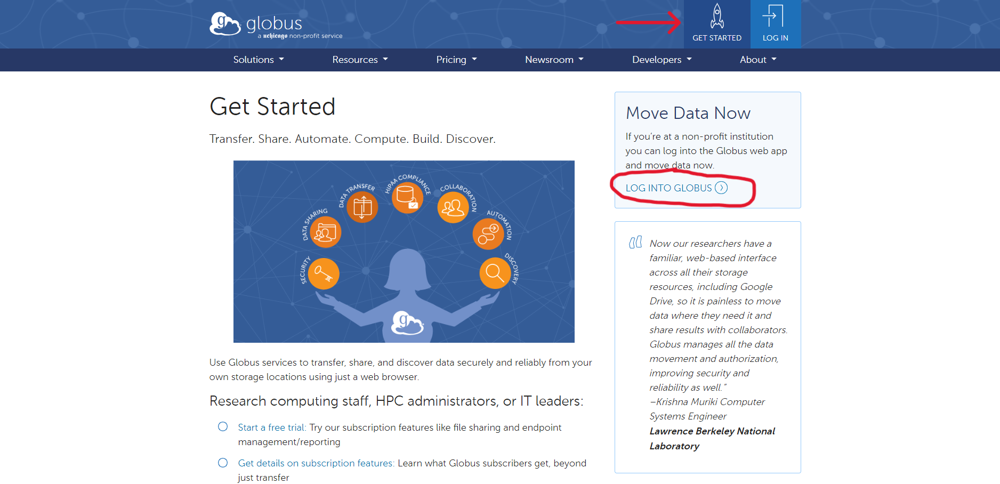

# Getting started with Globus
If you are with a non-profit institution, you can log in and get started moving data instantly, for free.

## Logging in for the first time
1. Navigate to [globus.org](https://www.globus.org/)
2. In the top right corner, click on "Get Started"
3. On the right side under "Move Data Now" click "Log into Globus"
    <figure markdown="span">
        
    </figure>
4. Search for your institution, then follow the prompts to log in with your institutional credentials.

## Transferring Data
Follow [this link](https://msi.umn.edu/our-resources/knowledge-base/file-transfer-faqs/how-do-i-use-globus-transfer-data-msi) to learn more about using Globus to transfer data to MSI.

## Globus Connect Personal
Globus Connect Personal is a downloadable application that will create an endpoint on your local drive and allow you to easily transfer files back and forth. To download Globus Connect Personal, please follow [this link.](https://www.globus.org/globus-connect-personal)

## Adding Bookmarks
Bookmarks are useful for quickly navigating to frequently used file paths.

To add a bookmark:

1. After you've logged in you'll be brought to the "File Manager" screen
2. Navigate to the "Bookmarks" tab on the left-side menu
3. Some destinations can be searched for by name (i.e. the Tier 1 storage at MSI), while others may require a direct file path
    <figure markdown="span">
        
    </figure>
4. Select the intended file path

!!! note
    Bookmarking Tier 1 storage requires you to log in and authenticate your MSI credentials. You must already have a MSI account to do this.

5. Click "Continue" and follow the prompts to log in **with your credentials.**
6. Once back in the "File Manager" tab, in the middle of the transfer box click the bookmark icon
    <figure markdown="span">
        
    </figure>
7. You can rename the path if you would like, then click "Create Bookmark"
8. To see your bookmarks, navigate to "Bookmarks" tab on the left-side menu. From here you can click on your saved bookmarks to quickly navigate to different directories
