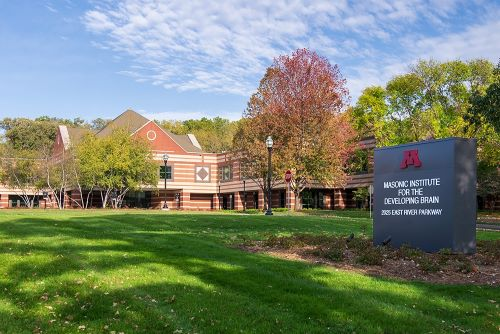

# MIDB Overview
<figure markdown="span" align='center'>
    
</figure>

MIDB is home to multiple research hubs devoted to fostering innovative and inspirational research on brain development. You can learn more about the MIDB Clinic, research hubs, community, events, and more on our website [https://midb.umn.edu/](https://midb.umn.edu/){:target="_blank"}. If you have any questions, please reach out to midbresearch@umn.edu.

## Research Hubs at MIDB
There are 8 Research Hubs operating out of MIDB; Analytics, Center for Neurobehavioral Development (CNBD), Community Engagement and Education (CEEd), Informatics, Neuroimaging, Neuromodulation, TeleOutreach, and Translational. If you would like to submit a research engagement request, please follow the instructions on the [process for engagement request](https://midb.umn.edu/research-services/engage-midb-service-hubs/process-engagement-request){:target="_blank"} page. For a list of on-going studies occurring at MIDB, please see the [current supported studies](https://midb.umn.edu/current-studies-supported-midb){:target="_blank"} page.

### Neuroimaging
The [Neuroimaging](https://midb.umn.edu/research/neuroimaging){:target="_blank"} assists with getting researchers access and training to operate and collect data on the 3T-D MRI at MIDB. Our team, lead by Steve Nelson the Hub director, provide consultation on study design and scanning parameters. Our Neuroimaging Specialists are adept at building specialized protocols and tasks catered to your project needs. Additionally Technicians and Infant Scanning Specialists are available to assist with data collection.

- [Analytics Hub](https://midb.umn.edu/research/analytics){:target="_blank"} offers support for data analytics and implementation. 

- [CNBD](https://midb.umn.edu/research/center-for-neurobehavioral-development){:target="_blank"} acts as a clinical research community inside of MIDB. 

- [CEEd](https://midb.umn.edu/research/community-engagement-education){:target="_blank"} aims to connect communities and care services to advance brain research and promote diversity in science.

- [Informatics](https://midb.umn.edu/research/informatics){:target="_blank"} offers support and consultation for the life cycle of research data.

- [Neuromodulation](https://midb.umn.edu/research/neuromodulation){:target="_blank"} develops and reseraches non-invasive pediatric interventions to improve pediatric outcomes.

- [TeleOutreach](https://midb.umn.edu/research/teleoutreach){:target="_blank"} utilizes telecommunication technology to enhance participant recruitment in education and research practices.

- [Translational](https://midb.umn.edu/research/translational){:target="_blank"} is devoted to generate laboratory discoveries that can rapidly and safely be translated into clinical approaches and delivery.